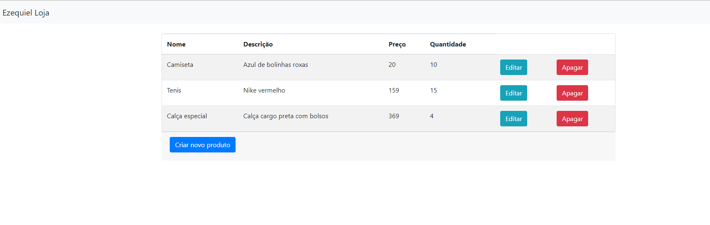

# Apresentação

Programa exemplo desenvolvido em Go Lang.
É uma aplicação WEB completa com bootstrap e GIN, para persistir um CRUD de produtos, quantidade e preços.

# Requisitos

Para executar o programa é necessário:
* Ter instalado o sdk do Go no seu sistema operacional. Pode ser pego em [https://go.dev/](https://go.dev/) 

# Recursos abordados

* Funções.
* Orientação de objetos.
* Modularização de packages.
* Utilização de rotas.
* MVC.
* Comunicação com banco de dados AWS em Mysql.
* CRUD completo em banco.
* Utilização de pacotes de terceiros.
* Validação de dados
* Testes unitários.
* Bootstrap.
* HTML com GO.

# Pacotes adicionais

* Para criação da API e gerenciamento do seu funcionamento: https://github.com/gin-gonic/gin, instalar go get -u github.com/gin-gonic/gin
* Para ORM para banco : https://gorm.io/index.html, para instalar "go get -u gorm.io/gorm"
* Driver Mysql para ORM: "go get gorm.io/driver/mysql"

# Compilar e roda

Para compilar        : go build main.go
Para compilar e rodar: go run main.go

Para corrigir problemas de referencia de packages ou para possibilitar rodar packages fora do GO_HOME:

"go mod init"

# Rodar local

Ao rodar a aplicação irá subir no endereço: http://localhost:8000.  A configuração da porta fica na "main.go"

# Imagens do programa

